# E-RequestControl

E-RequestControl is a comprehensive solution for managing electronic requests in an enterprise environment. The system is designed to streamline the process of submitting, reviewing, and approving requests, ensuring efficiency and transparency.

## 🛠 Features

- **Request Submission**: Users can submit various types of requests through an intuitive interface.
- **Approval Workflow**: Requests go through a defined approval process, ensuring proper oversight.
- **Audit Trail**: All actions are logged for accountability and traceability.
- **Notifications**: Users receive timely notifications about the status of their requests.

## 🏗 Architecture

The system is built using the following technologies:

- **Backend**: Go (Golang) for the API and business logic.
- **Frontend**: Vue.js for the user interface.
- **Database**: PostgreSQL for data storage.
- **Containerization**: Docker for containerizing the application components.
- **Orchestration**: Kubernetes (EKS) for managing containerized applications.
- **CI/CD**: GitHub Actions for continuous integration and deployment.

## 📊CI/CD Pipeline Diagram

```mermaid
graph TD
    A[Start: Manual Launch] --> B[Code Check]
    B --> C[Environment Setup]
    C --> D[SonarQube Code Analysis]
    D --> E[Build & Publish Images]
    E --> F[Frontend → ECR]
    E --> G[Backend → ECR]
    E --> H[Database → ECR]
    F --> I[Clean Old Images]
    G --> I
    H --> I
    I --> J[Deploy to EKS]
    J --> K[EKS Access Setup]
    K --> L[Database Secrets]
    L --> M[Install Cert-Manager]
    M --> N[Monitoring: Prometheus & Loki]
    N --> O[Deploy Helm Chart]
    O --> P[Done]
```

